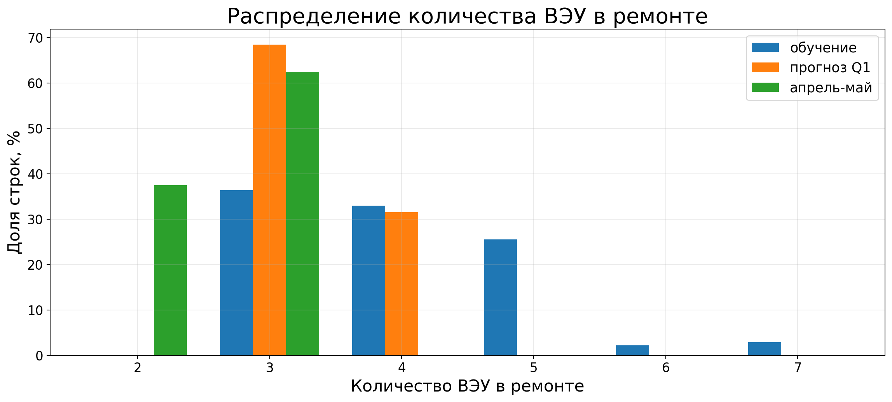
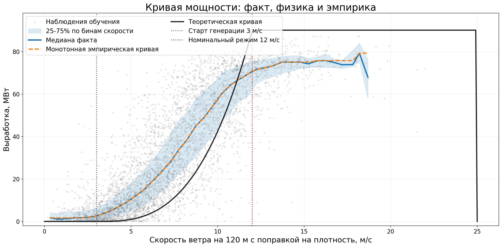
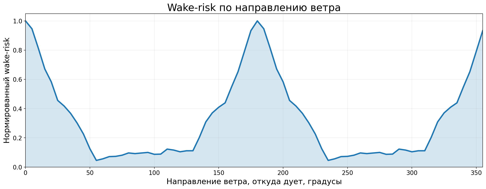
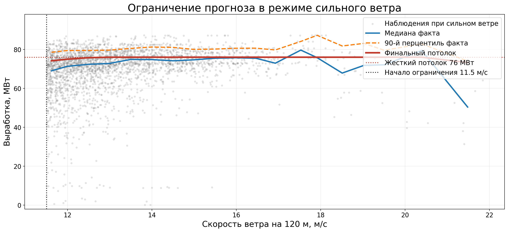
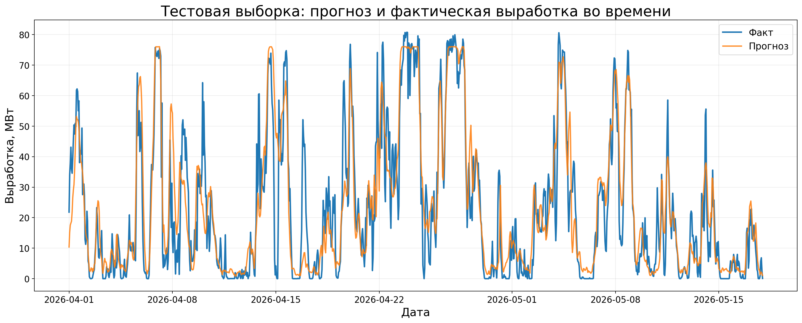
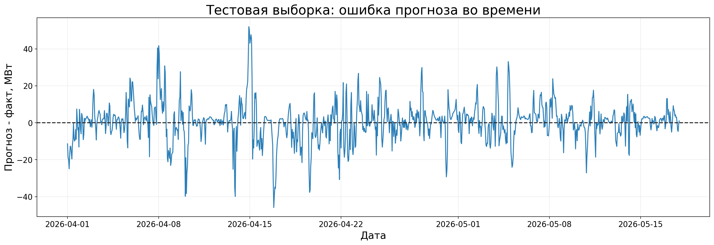
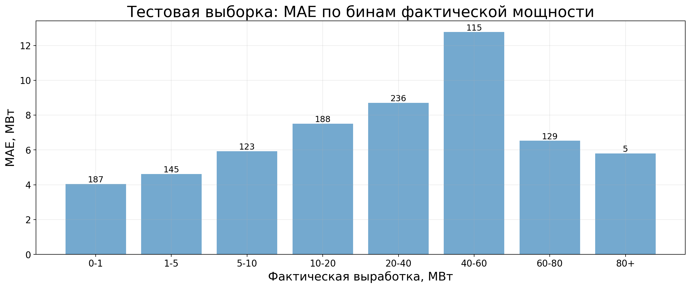
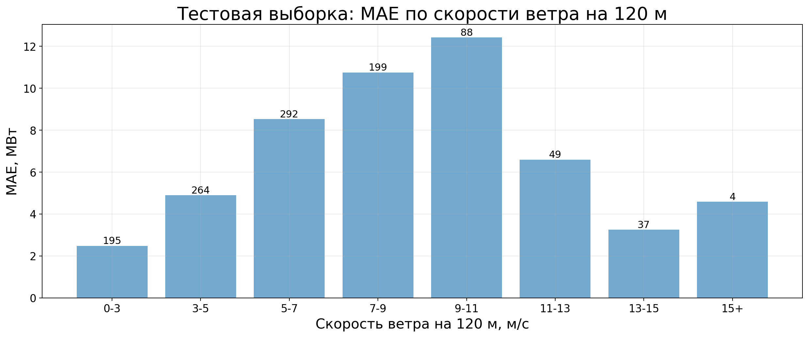

# Прогноз почасовой выработки ВЭС

Репозиторий содержит полный пайплайн для прогноза почасовой выработки ветроэлектростанции. Код разложен по трем ноутбукам: сборка признаков, обучение моделей и отдельный запуск inference с метриками. Такой порядок выбран специально: после обучения третий ноутбук может стартовать из чистого kernel, загрузить сохраненные веса и получить тот же формат submission без повторного `.fit()`.

Монолитный `ves_pipeline.ipynb` оставлен как архивная версия. Основной рабочий вариант находится в файлах `01_build_feature_dataset.ipynb`, `02_train_and_save_models.ipynb`, `03_postprocess_metrics_plots.ipynb` и `ves_pipeline_core.py`.

## быстрый запуск

Ноутбуки запускаются строго по порядку.

| Шаг | Файл | Роль в пайплайне | Что появляется на выходе |
|---:|---|---|---|
| 1 | `01_build_feature_dataset.ipynb` | Читает исходные таблицы, строит признаки, фиксирует список колонок для моделей | `outputs/datasets/*` |
| 2 | `02_train_and_save_models.ipynb` | Обучает ансамбль, two-stage correction и сохраняет веса | `outputs/models/model_artifacts.joblib` |
| 3 | `03_postprocess_metrics_plots.ipynb` | Загружает готовые признаки и веса, делает прогноз, строит метрики и графики | `outputs/submission_final.csv`, `outputs/test/*` |

Установка окружения:

```powershell
python -m venv .venv
.\.venv\Scripts\activate
pip install -r requirements.txt
```

## входные данные

Исходные таблицы лежат в `data/`.

| Файл | Назначение | Строк |
|---|---|---:|
| `data/train_merged.csv` | История для обучения с фактической выработкой | 32434 |
| `data/valid_merged.csv` | Валидационный период, для которого формируется submission | 2126 |
| `data/test_merged.csv` | Test-период с частично известным фактом для локальной проверки | 1152 |
| `data/train.csv`, `data/valid.csv`, `data/test.csv` | Резервные исходные версии | - |

Целевая колонка в train:

```text
Выработка. Результирующий расчет
```

Внутри пайплайна создается `row_id`. Он нужен только для восстановления исходного порядка строк в submission: признаки и модели могут сортировать данные по времени, но финальный CSV возвращается в порядок входного файла.


## что делает первый ноутбук

`01_build_feature_dataset.ipynb` собирает модельные таблицы из исходных данных. Логика идет сверху вниз, без одного большого скрытого блока.

Основные группы признаков:

| Блок | Что рассчитывается | Зачем это нужно |
|---|---|---|
| Календарь | месяц, час, циклические признаки времени | Модель видит сезонность и суточные режимы |
| Ветер | скорости и направления на разных высотах, сдвиги ветра, gust ratio | Основной физический сигнал для выработки |
| Ремонт | количество ВЭУ в ремонте, доступная мощность | Ограничивает возможную генерацию станции |
| Power curve | теоретическая и эмпирическая кривая мощности | Дает физическую опору и базовый уровень прогноза |
| NWP-контекст | соседние forecast horizons, локальные сглаживания | Помогает ловить переходные моменты погоды |
| Геометрия ВЭС | кластеры турбин, осевые признаки, wake-risk | Учитывает расположение турбин и направление ветра |
| Full-physics | скрытые потери, восстановленная мощность, коэффициенты эффективности | Отделяет погодную часть от ограничений станции |
| High-wind | признаки режима сильного ветра и cap-кривая | Снижает завышения на плато мощности |

Сохраненные результаты первого ноутбука:

| Путь | Содержание |
|---|---|
| `outputs/datasets/train_features.csv` | Признаки для обучения |
| `outputs/datasets/valid_features.csv` | Признаки для submission |
| `outputs/datasets/test_features.csv` | Признаки для локальной проверки |
| `outputs/datasets/model_features.json` | Список колонок, которые подаются в модели |
| `outputs/datasets/feature_artifacts.joblib` | Объекты, нужные для повторяемого построения признаков |
| `outputs/datasets/test_actual.csv` | Факт test отдельно от признаков, только для расчета метрик |

Текущий feature contract:

| Набор | Строк | Колонок в CSV |
|---|---:|---:|
| train features | 32434 | 213 |
| valid features | 2126 | 206 |
| test features | 1152 | 206 |

В модели передается 185 признаков.

## ремонт и доступная мощность

В данных есть признак количества ВЭУ в ремонте. Он не используется как простая декоративная колонка: из него получается доступная мощность станции и несколько производных признаков. Это важно, потому что одинаковый ветер может давать разную выработку при разном числе работающих турбин.

На графиках видно, что распределение ремонтов в train, valid и test не полностью одинаковое. Поэтому ремонтные признаки полезны, но с ними нельзя строить слишком агрессивные поправки: часть repair-сигнала может быть месячной или усредненной, а не точным почасовым состоянием.




## power curve: физика и эмпирика

В пайплайне используются две разные идеи.

Физическая кривая мощности задает ожидаемую форму зависимости между скоростью ветра и выработкой: старт генерации около cut-in, рост в рабочей зоне, выход на плато около номинального режима и остановка после cut-out. Эта кривая дает базовую физическую логику, но сама по себе она слишком идеальна.

Эмпирическая кривая строится только по train. Для каждого диапазона скорости ветра берутся фактические значения выработки, затем рассчитываются сглаженные статистики. Такая кривая ближе к реальному поведению станции: она учитывает ограничения, ремонты, потери, насыщение и неидеальность прогноза погоды.



## геометрия ВЭС и wake-risk

Для 26 турбин отдельно заведены координаты. По ним строятся layout-признаки: положение турбины внутри парка, кластеры, осевые проекции и риск взаимного затенения при разных направлениях ветра.

`layout_wake_risk_scalar_120m` рассчитывается как сглаженная функция направления ветра на высоте 120 м. Идея простая: при одних направлениях поток проходит через несколько рядов турбин, при других затенение меньше. Это не полноценная CFD-модель, но как табличный признак для градиентных моделей работает устойчиво.




## full-physics decomposition

Блок full-physics пытается разложить наблюдаемую выработку на несколько частей: идеальная доступная мощность, скрытые потери, доступность станции, погодные коэффициенты и восстановленная мощность. Он не заменяет ML-модель, а дает ей признаки, которые ближе к инженерной постановке задачи.

Отдельная OOT-диагностика сравнивает ошибки разных физических приближений. По ней видно, что эмпирическая кривая и физическая реконструкция не одинаковы: каждая ловит свою часть поведения станции. Поэтому эти признаки идут в ансамбль, а не используются как единственный прогноз.


## как обучается модель

Обучение находится во втором ноутбуке. Он не пересобирает признаки, а читает уже сохраненные таблицы из `outputs/datasets/`. Это уменьшает риск случайно обучить модель на другом наборе колонок.

### Direct ensemble

Первая часть модели сразу прогнозирует выработку или остаток относительно эмпирической кривой.

| Компонент | Что учит | Роль в ансамбле |
|---|---|---|
| `cat_mae_direct` | Целевую выработку напрямую | Основная нелинейная модель по всем признакам |
| `xgb_residual` | Остаток относительно empirical curve | Исправляет зоны, где кривая мощности систематически ошибается |
| `lgb_residual` | Остаток относительно empirical curve | Дает альтернативную residual-модель с другой структурой деревьев |
| `hgb_q530`, `hgb_q545`, `hgb_q570` | Близкие к медиане квантили | Стабилизируют прогноз и снижают влияние выбросов |

Веса direct ensemble зафиксированы:

```text
cat_mae_direct  0.361831
hgb_q545        0.235409
xgb_residual    0.177644
hgb_q570        0.116581
lgb_residual    0.064663
hgb_q530        0.043873
```

Такая смесь получилась устойчивее, чем один лучший алгоритм. CatBoost дает основной прогноз, residual-модели подтягивают отклонения от power curve, а quantile-модели немного приглушают резкие ошибки.

### Two-stage correction

Вторая часть модели обучается как аккуратная поправка, а не как замена direct ensemble.

Stage A оценивает нормальное поведение станции. Для этого используется `TimeSeriesSplit(n_splits=5, gap=24)`: train делится по времени, между обучением и проверкой оставляется зазор 24 часа. Из normal-ветки убираются признаки, напрямую связанные со скрытыми потерями и реконструкцией, чтобы модель сначала описала обычную генерацию по погоде, календарю и геометрии.

Stage B учит остаток:

```text
deviation_target = target - stage_a_prediction
```

Остаток обрезается по квантилям, чтобы отдельные редкие пики не испортили residual-модель. После этого Stage B прогнозирует отклонение от нормального режима, а итог two-stage считается как сумма normal prediction и predicted deviation.

Финальная смесь:

```text
blend = 0.90 * direct_ensemble + 0.10 * two_stage
final = high_wind_clip(blend)
```

Доля two-stage оставлена небольшой. На локальной проверке такая поправка иногда помогает на переходных режимах, но при большом весе начинает ухудшать стабильность.

### High-wind post-processing

При сильном ветре модель может завышать прогноз, потому что по физике рост скорости должен вести к высокому плато, а фактическая станция иногда дает просадки: ограничения, отключения, турбулентность, неверный прогноз ветра или сочетание этих факторов.

Для этого после ансамбля применяется empirical high-wind clip. Он строится по train: берутся наблюдения при скорости ветра выше заданного порога, по бинам скорости оценивается верхний допустимый уровень выработки, затем прогноз мягко прижимается к этой cap-кривой.

Используемая схема:

```text
corrected = prediction - strength * gate(high_wind) * max(prediction - empirical_cap, 0)
```

В текущей конфигурации ограничение включается примерно после 11.5 м/с. Финальный cap не просто режет все значения одним числом, а зависит от скорости ветра.



## что сохраняет второй ноутбук

| Путь | Содержание |
|---|---|
| `outputs/models/model_artifacts.joblib` | Все обученные модели, признаки, cap-кривые и параметры постпроцессинга |
| `outputs/models/training_summary.csv` | Краткая сводка обучения |
| `outputs/models/valid_training_predictions.csv` | Direct, two-stage и final prediction на valid |
| `outputs/models/stage_a_normal_fold_report.csv` | Fold-отчет Stage A |
| `outputs/models/stage_b_deviation_fold_report.csv` | Fold-отчет Stage B |
| `outputs/ts/high_wind_cap_curve_two_stage_training.csv` | Cap-кривая, построенная во время обучения |

Текущая сводка обучения:

| Метрика | Значение |
|---|---:|
| direct valid mean | 39.725 |
| two-stage valid mean | 41.164 |
| final valid mean | 39.829 |
| model features | 185 |
| normal OOF MAE | 10.671 |

## третий ноутбук: inference, submission и метрики

`03_postprocess_metrics_plots.ipynb` предназначен для чистого запуска после обучения. Он загружает `outputs/datasets/*` и `outputs/models/model_artifacts.joblib`, применяет сохраненные модели и не вызывает `.fit()` для основных алгоритмов.

Выходы:

| Путь | Содержание |
|---|---|
| `outputs/submission_final.csv` | Submission для `valid_merged.csv` |
| `outputs/test/submission_final.csv` | Прогноз для всего `test_merged.csv` |
| `outputs/test/submission_2026-05-18.csv` | Отдельный прогноз для строк 18.05.2026 |
| `outputs/test/test_prediction_vs_actual.csv` | Таблица факт/прогноз там, где факт известен |
| `outputs/test/test_prediction_metrics.csv` | Локальные метрики test |
| `outputs/test/prediction_diagnostics.csv` | Диагностика direct, two-stage и final prediction |
| `outputs/test/figures/` | Финальные графики проверки |

Локальные test-метрики по строкам с известным фактом:

| Метрика | Значение |
|---|---:|
| rows total | 1152 |
| rows with actual | 1128 |
| rows without actual | 24 |
| MAE | 7.095 МВт |
| RMSE | 10.462 МВт |
| Median AE | 4.333 МВт |
| P90 AE | 16.634 МВт |
| Bias | +0.725 МВт |
| Corr(actual, prediction) | 0.896 |





Диагностика показывает, что самые сложные зоны остаются в средних режимах мощности и в диапазоне скорости ветра примерно 7-11 м/с. На очень низкой мощности ошибка меньше, потому что там проще угадать ноль или близкое к нулю значение. На высоких значениях помогает high-wind clip, но отдельные просадки станции все равно полностью не объясняются погодными признаками.





## графики и папки

Для отчета и README используются картинки из `docs/figures/`. Это стабильная папка с отобранными иллюстрациями.

Автоматически пересоздаваемые графики остаются в `outputs/figures/` и `outputs/test/figures/`. Их можно удалять перед новым прогоном, если нужно получить чистый запуск. Данные, модели и submission лучше держать отдельно:

```text
outputs/datasets/   признаки и feature contract
outputs/models/     обученные веса и отчеты обучения
outputs/test/       test-прогноз, метрики и диагностические таблицы
docs/figures/       картинки для README и отчета
```

Флаги построения графиков находятся в начале ноутбуков:

```python
PLOT_RESEARCH_OUTPUTS = True
PLOT_FINAL_DISTRIBUTIONS = True
RUN_POWER_CURVE_DIAGNOSTIC = True
PLOT_TWO_STAGE_DIAGNOSTICS = True
SAVE_DIAGNOSTIC_ARTIFACTS = True
SAVE_DIRECT_DEBUG_SUBMISSIONS = True
```

## карта проекта

```text
data/
  train_merged.csv
  valid_merged.csv
  test_merged.csv

map/
  data/
    wind_farm_coords.csv
    wind_farm_anchors.csv
  figures/
    wind_farm_map.png
    wind_farm_marked_map.png
  map_builder.py

docs/
  figures/

outputs/
  datasets/
    train_features.csv
    valid_features.csv
    test_features.csv
    model_features.json
    feature_artifacts.joblib
  models/
    model_artifacts.joblib
    training_summary.csv
    valid_training_predictions.csv
    stage_a_normal_fold_report.csv
    stage_b_deviation_fold_report.csv
  test/
    submission_final.csv
    submission_2026-05-18.csv
    test_prediction_metrics.csv
    test_prediction_vs_actual.csv
    prediction_diagnostics.csv
    figures/
  submission_final.csv

01_build_feature_dataset.ipynb
02_train_and_save_models.ipynb
03_postprocess_metrics_plots.ipynb
ves_pipeline_core.py
ves_pipeline.ipynb
requirements.txt
README.md
```

## воспроизводимость

- Empirical power curve, high-wind cap и feature artifacts строятся только по train.
- `valid_merged.csv` не используется как источник факта для обучения.
- Test-факт, если он есть, используется только для локальных метрик и графиков.
- В третьем ноутбуке основные модели не обучаются заново.
- Если меняются признаки, параметры моделей или post-processing, нужно перезапустить все три ноутбука по порядку.
- `outputs/datasets/` и `outputs/models/` можно пересоздать из исходных данных, но без них третий ноутбук не выполнит clean inference.

